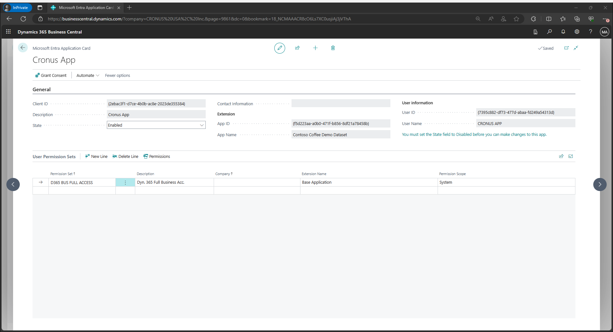

[[_TOC_]]

# Introduction

Quite often, Microsoft Partners are faced with a situation where they need to gain access to the customer’s API, using [OAuth 2.0 Service-to-Service (S2S) Authentication](https://learn.microsoft.com/en-us/dynamics365/business-central/dev-itpro/administration/automation-apis-using-s2s-authentication).

To set up service-to-service authentication, we have to do two things:

- Register an application in **Customer** Microsoft Entra ID tenant for authenticating API calls against Business Central.

- Grant access for that application in **Customer** Business Central.

It means that for every customer we should register a new application, keep secrets for all customers, recevie the new secrets after expiring the old ones. This is quite a time-consuming task, taking into account security issues.

There is another way to optimize the configuration. It also consists the next steps:

- Register Microsoft Entra ID application in in **Partner** tenant for authenticating API calls against Business Central.

- Set up the Microsoft Entra application in Business Central. Grant access for that application in **Customer** Business Central.

- Keep secrets & certificates in **Key Vault**. Configure auto-rotation in **Key Vault**.

- Configure **Azure App configuration**. Add a reference to the Key Vault in App Configuration.

- Configure your system to use **Azure App configuration**.

- Renew expiring application credentials.

- Reload secrets and certificates from Key Vault automatically.

The fundamental difference is that we register in speciall allocated for this purposes partner (not customer) Microsoft Entra ID. In this case we can manage secret.
Another point, since secrets are expired after two years maximum, renewing the app secret(s) before its expiration ensures the application continues to function and reduces the possibility of downtime due to an expired credential.

**We significantly reduce the time it takes to install our product**

# 1. Register Microsoft Entra ID application in **Partner** tenant

## Register Application

Follow the general guidelines at [Register your application with your Microsoft Entra tenant](https://learn.microsoft.com/en-us/azure/active-directory/active-directory-app-registration).

Registering your application establishes a trust relationship between your app and the Microsoft identity platform. The trust is unidirectional: your app trusts the Microsoft identity platform, and not the other way around. Once created, the application object cannot be moved between different tenants.

Follow these steps to create the app registration:

1. Sign in to the [Microsoft Entra admin center](https://entra.microsoft.com) as at least a [Cloud Application Administrator](~/identity/role-based-access-control/permissions-reference.md#cloud-application-administrator).
2. If you have access to multiple tenants, use the **Settings** icon  in the top menu to switch to the tenant in which you want to register the application from the **Directories + subscriptions** menu.
3. Browse to **Identity** > **Applications** > **App registrations** and select **New registration**.

4. Enter a display **Name** for your application. Users of your application might see the display name when they use the app, for example during sign-in.
   You can change the display name at any time and multiple app registrations can share the same name. The app registration's automatically generated Application (client) ID, not its display name, uniquely identifies your app within the identity platform.
5. Specify who can use the application, sometimes called its _sign-in audience_. Select **Accounts in any organizational directory**

   | Supported account types                                                      | Description                                                                                                                                                                                                                                                                                                                                                                                 |
   | ---------------------------------------------------------------------------- | ------------------------------------------------------------------------------------------------------------------------------------------------------------------------------------------------------------------------------------------------------------------------------------------------------------------------------------------------------------------------------------------- |
   | **Accounts in any organizational directory**                                 | Select this option if you want users in _any_ Microsoft Entra tenant to be able to use your application. This option is appropriate if, for example, you're building a software-as-a-service (SaaS) application that you intend to provide to multiple organizations.  This type of app is known as a _multitenant_ application in the Microsoft identity platform. |

6. Add redirect URI. A _redirect URI_ is the location where the Microsoft identity platform redirects a user's client and sends security tokens after authentication. You can do this later clicking on link (**Add a Redirect URI**) against **Redirect URIs** property on registered **Application Overview** page or select Authentication section in Registered Application menu blade.

    - Click on **Add a platform** and select **Web**.

    - Specify the Redirect URIs for your Business Central browser client -
  <https://businesscentral.dynamics.com/OAuthLanding.htm>.
  This URL is used to manage the exchange of data between Business Central and other services through Microsoft Entra ID.

7. Select **Register** to complete the platform configuration.

   

When registration finishes, the Microsoft Entra admin center displays the app registration's **Overview** pane. You see the **Application (client) ID**. Also called the _client ID_, this value uniquely identifies your application in the Microsoft identity platform.

> **IMPORTANT**
> _New app registrations are hidden to users by default. When you are ready for users to see the app on their [My Apps page](https://support.microsoft.com/account-billing/sign-in-and-start-apps-from-the-my-apps-portal-2f3b1bae-0e5a-4a86-a33e-876fbd2a4510) you can enable it. To enable the app, in the Microsoft Entra admin center navigate to **Identity** > **Applications** > **Enterprise applications** and select the app. Then on the **Properties** page toggle **Visible to users?** to Yes._

Your application's code, or more typically an authentication library used in your application, also uses the client ID. The ID is used as part of validating the security tokens it receives from the identity platform.

## Add a redirect URI

If you didn't add redirect URi in p.6 than you can do this in **Authentication section**.

Settings for each application type, including redirect URIs, are configured in **Platform configurations** in the Azure portal. Some platforms, like **Web** and **Single-page applications**, require you to manually specify a redirect URI. For other platforms, like mobile and desktop, you can select from redirect URIs generated for you when you configure their other settings.

To configure application settings based on the platform or device you're targeting, follow these steps:

1. In the Microsoft Entra admin center, in **App registrations**, select your application.
1. Under **Manage**, select **Authentication**.
1. Under **Platform configurations**, select **Add a platform**.
1. Under **Configure platforms**, select **Web**.
1. Specify the Redirect URIs for your Business Central browser client -
  <https://businesscentral.dynamics.com/OAuthLanding.htm>.

## Add credentials

Credentials are used by [confidential client applications](https://learn.microsoft.com/en-us/entra/identity-platform/msal-client-applications) that access a web API.

Create a client secret for the registered application as follows:

1. Select **Certificates & secrets > New client secret**.
2. Add a **Description** for your client secret.
3. Select an expiration for the secret or specify a custom lifetime.

> **ATTENTION**
> _Client secret lifetime is limited to two years (24 months) or less._
> _You can't specify a custom lifetime longer than 24 months._

4. Select Add.

>**NOTE**
>_Copy the secret's value for use in your client application. This secret value is never displayed again after you leave this page._

## Grant permissions

Grant the registered application **API.ReadWrite.All** permission to the Dynamics 365 Business Central API as follows:

1. Select **API permissions > Add a permission > Microsoft APIs**.
2. Select **Dynamics 365 Business Central**.
3. Select **Application permissions**, select **API.ReadWrite.All**, then select Add permissions.

The API permissions page will include one of the following entries:
|API / Permission name|Type|Description|
|-|-|-|
|Dynamics 365 Business Central / API.ReadWrite.All|Application|Access to APIs and webservices|

# Set up the Microsoft Entra application in Business Central.

Complete these steps to set up the Microsoft Entra application for service-to-service authentication in Business Central.

>**NOTE**
> _It should be completed **by customer** in their Business Central environment._

1. In the Business Central client, search for **Microsoft Entra applications** and open the page.

2. Select **New**. The Microsoft Entra application Card page opens.
3. In the **Client ID** field, enter the **Application (Client) ID** for the application registered in the previous section.
4. Fill in the **Description** field. If this application is set up by a partner, please enter sufficient partner-identifying information, so all applications set up by this partner can be tracked in the future if necessary.
5. Set the State to Enabled.
6. Assign permissions to objects as needed.

7. Accept permission request. Click on **Grant Consent** and in the open window click "Accept".
 

# Automate the rotation of a secret for application registered in Microsoft Entra ID
In a situation where we need to store hundreds of secrets for different customers and need to update them periodically (the maximum period is 2 years, for security reasons the keys need to be updated much more often), it will be quite difficult without automatically reloading the keys.

You are offered the idea of ​​​​creating an application that will update keys automatically

## Keep secret(s) in **Azure Key Vault**

[Create a key vault using the Azure portal](https://learn.microsoft.com/en-us/azure/key-vault/general/quick-create-portal)

[Azure Key Vault developer's guide](https://learn.microsoft.com/en-us/azure/key-vault/general/developers-guide)

[Use Key Vault references in an ASP.NET Core app](https://learn.microsoft.com/en-us/azure/azure-app-configuration/use-key-vault-references-dotnet-core?tabs=core6x)

[Configure cryptographic key auto-rotation in Azure Key Vault](https://learn.microsoft.com/en-us/azure/key-vault/keys/how-to-configure-key-rotation)

## Add reference to the Key Vault Secrets in **Azure App Configuration**

[What is Azure App Configuration?](https://learn.microsoft.com/en-us/azure/azure-app-configuration/overview)

[Use dynamic configuration in an ASP.NET Core app](https://learn.microsoft.com/en-us/azure/azure-app-configuration/enable-dynamic-configuration-aspnet-core?tabs=core6x)

[Quickstart: Create a .NET app with App Configuration](https://learn.microsoft.com/en-us/azure/azure-app-configuration/quickstart-dotnet-core-app?source=recommendations&tabs=core6x%2Cwindowscommandprompt)

## Reload secrets from Key Vault automatically

[Reload secrets and certificates from Key Vault automatically](https://learn.microsoft.com/en-us/azure/azure-app-configuration/reload-key-vault-secrets-dotnet)

[Automate the rotation of a secret for resources that use one set of authentication credentials](https://learn.microsoft.com/en-us/azure/key-vault/secrets/tutorial-rotation)